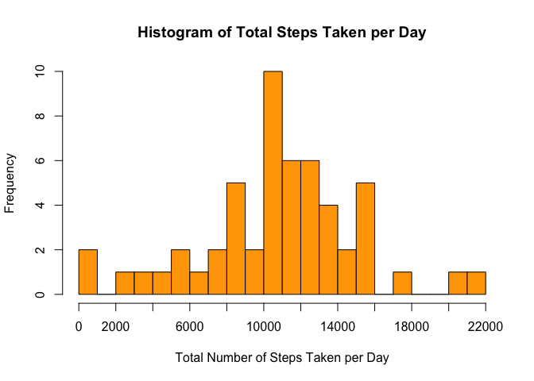
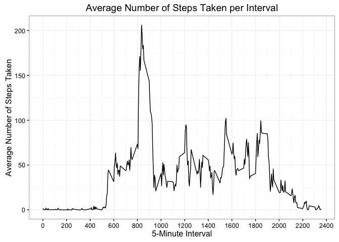
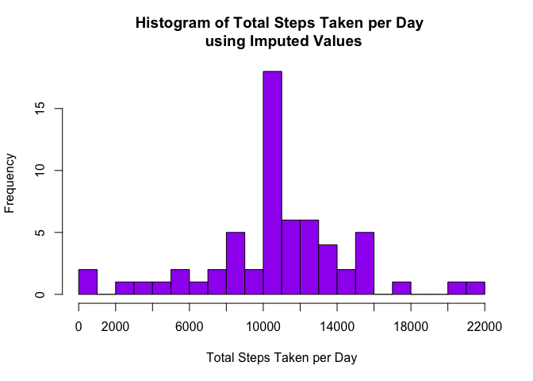
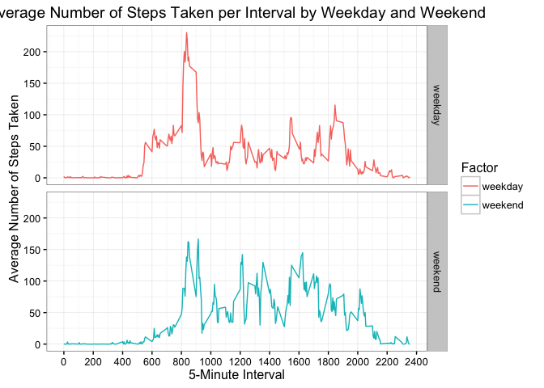

# Reproducible Research: Peer Assessment 1
Katie Lyon  
January 10, 2016  


```r
# load packages
library(ggplot2)
library(knitr)
```

## Introduction

It is now possible to collect a large amount of data about personal
movement using activity monitoring devices such as a
[Fitbit](http://www.fitbit.com), [Nike Fuelband](http://www.nike.com/us/en_us/c/nikeplus-fuelband), or
[Jawbone Up](https://jawbone.com/up). These types of devices are part of
the "quantified self" movement -- a group of enthusiasts who take
measurements about themselves regularly to improve their health, to
find patterns in their behavior, or because they are tech geeks. But
these data remain under-utilized both because the raw data are hard to
obtain and there is a lack of statistical methods and software for
processing and interpreting the data.

This assignment makes use of data from a personal activity monitoring
device that collects data at 5 minute intervals through out the
day. The data consists of two months of data from an anonymous
individual collected during the months of October and November 2012,
and include the number of steps taken in 5 minute intervals each day.

## Data

The data for this assignment can be downloaded from the course web
site:

* Dataset: [Activity monitoring data](https://d396qusza40orc.cloudfront.net/repdata%2Fdata%2Factivity.zip) [52K]

The variables included in this dataset are:

* **steps**: Number of steps taking in a 5-minute interval (missing
    values are coded as `NA`)

* **date**: The date on which the measurement was taken in YYYY-MM-DD
    format

* **interval**: Identifier for the 5-minute interval in which
    measurement was taken

The dataset is stored in a comma-separated-value (CSV) file and there are a total of 17,568 observations in the dataset.


## Assignment

### Loading and preprocessing the data

1. Load the data

```r
# unzip the data
unzip("activity.zip")

# read in the data
dat <- read.csv('activity.csv')
```

2. Check the structure of the data

```r
str(dat)
```

```
## 'data.frame':	17568 obs. of  3 variables:
##  $ steps   : int  NA NA NA NA NA NA NA NA NA NA ...
##  $ date    : Factor w/ 61 levels "2012-10-01","2012-10-02",..: 1 1 1 1 1 1 1 1 1 1 ...
##  $ interval: int  0 5 10 15 20 25 30 35 40 45 ...
```

```r
summary(dat)
```

```
##      steps                date          interval     
##  Min.   :  0.00   2012-10-01:  288   Min.   :   0.0  
##  1st Qu.:  0.00   2012-10-02:  288   1st Qu.: 588.8  
##  Median :  0.00   2012-10-03:  288   Median :1177.5  
##  Mean   : 37.38   2012-10-04:  288   Mean   :1177.5  
##  3rd Qu.: 12.00   2012-10-05:  288   3rd Qu.:1766.2  
##  Max.   :806.00   2012-10-06:  288   Max.   :2355.0  
##  NA's   :2304     (Other)   :15840
```

3. Process/transform the data

```r
# Convert date column from character to date
dat$date <- as.Date(dat$date)

# Create new data frame, removing missing values
datClean <- na.omit(dat)

# Check structure of clean dataset
str(datClean)
```

```
## 'data.frame':	15264 obs. of  3 variables:
##  $ steps   : int  0 0 0 0 0 0 0 0 0 0 ...
##  $ date    : Date, format: "2012-10-02" "2012-10-02" ...
##  $ interval: int  0 5 10 15 20 25 30 35 40 45 ...
##  - attr(*, "na.action")=Class 'omit'  Named int [1:2304] 1 2 3 4 5 6 7 8 9 10 ...
##   .. ..- attr(*, "names")= chr [1:2304] "1" "2" "3" "4" ...
```

```r
summary(datClean)
```

```
##      steps             date               interval     
##  Min.   :  0.00   Min.   :2012-10-02   Min.   :   0.0  
##  1st Qu.:  0.00   1st Qu.:2012-10-16   1st Qu.: 588.8  
##  Median :  0.00   Median :2012-10-29   Median :1177.5  
##  Mean   : 37.38   Mean   :2012-10-30   Mean   :1177.5  
##  3rd Qu.: 12.00   3rd Qu.:2012-11-16   3rd Qu.:1766.2  
##  Max.   :806.00   Max.   :2012-11-29   Max.   :2355.0
```


### What is mean total number of steps taken per day?

Note: For this part of the assignment, missing values in the dataset are ignored.

1. Make a histogram of the total number of steps taken each day

First, compute the total number of steps taken each day: 

```r
# Compute total number of steps
dailySteps <- aggregate(datClean$steps ~ datClean$date, FUN=sum, na.rm=TRUE)

# add column names
colnames(dailySteps) <- c("date", "totalSteps")
```

Determine the maximum steps taken: 

```r
# maximum steps taken
max(dailySteps$totalSteps)
```

```
## [1] 21194
```

Make the histogram:

```r
hist(dailySteps$totalSteps, 
     col = "orange",
     main = "Histogram of Total Steps Taken per Day",
     breaks = 20,
     xaxt='n', 
     xlim = c(0,22000),
     xlab="Total Number of Steps Taken per Day"
     )

# define x-axis ticks and labels
axis(side=1, at=seq(0,22000,2000), labels=seq(0,22000,2000))
```

\

2. Calculate and report the mean and median total number of steps taken per day

Mean number of steps taken per day:

```r
mean(dailySteps$totalSteps)
```

```
## [1] 10766.19
```

Median number of steps taken per day:

```r
median(dailySteps$totalSteps)
```

```
## [1] 10765
```

### What is the average daily activity pattern?

1. Make a time series plot of the 5-minute interval (x-axis) and the average number of steps taken, averaged across all days (y-axis)


```r
# calculate average number of steps at each 5-minute interval
intervalSteps <- aggregate(dat$steps ~ dat$interval, FUN=mean, na.rm=TRUE)

# rename the columns
colnames(intervalSteps) <- c("interval", "averageSteps")

# create a line plot of the average steps taken per interval
ggplot(intervalSteps, aes(interval, averageSteps)) + 
  geom_line() + 
  theme_bw() +
  coord_cartesian(xlim = c(0,2355)) + 
  scale_x_continuous(breaks=seq(0, 2400, 200)) + 
  labs(x="5-Minute Interval",
       y="Average Number of Steps Taken", 
       title="Average Number of Steps Taken per Interval")
```

\

2. Which 5-minute interval, on average across all the days in the dataset, contains the maximum number of steps?


```r
intervalSteps[which.max(intervalSteps$averageSteps), ]
```

```
##     interval averageSteps
## 104      835     206.1698
```


### Imputing missing values

Note that there are a number of days/intervals where there are missing
values (coded as `NA`). The presence of missing days may introduce
bias into some calculations or summaries of the data.

1. Calculate and report the total number of missing values in the dataset (i.e. the total number of rows with `NA`s)


```r
# Calculate number of missing values in the dataset
sum(is.na(dat))
```

```
## [1] 2304
```

2. Create a new dataset that is equal to the original dataset but with the missing data filled in. Missing values in the dataset are filled in by replacing each missing value with the mean value of its 5-minute interval.


```r
# create a copy of the original dataset
datImputed <- dat
# add the average interval steps as a column to the data frame
datImputed <- cbind(datImputed,intervalSteps$averageSteps)
# find the rows with NA's
na <- which(is.na(datImputed))
# replace NA's with average steps for the corresponding 5-minute interval
datImputed[na,]$steps <- datImputed[na,4]
# verify  there are 0 NAs in the steps column
sum(is.na(datImputed$steps))
```

```
## [1] 0
```


3. Make a histogram of the total number of steps taken each day using imputed data. 


```r
# sum the number of steps for each day
dailyStepsImp <- aggregate(datImputed$steps ~ datImputed$date, FUN=sum, na.rm=TRUE)

# rename the columns
colnames(dailyStepsImp) <- c("date", "totalSteps")
```


```r
# create a histogram
hist(dailyStepsImp$totalSteps, 
     col = "purple", 
     breaks = 20, 
     main = "Histogram of Total Steps Taken per Day \n using Imputed Values", 
     xaxt='n', 
     xlim = c(0,22000), 
     xlab = "Total Steps Taken per Day")

# define the x-axis ticks and labels
axis(side=1, at=seq(0,22000,2000), labels=seq(0,22000,2000))
```

\

4. Calculate and report the **mean** and **median** total number of steps taken per day. Do these values differ from the estimates from the first part of the assignment? What is the impact of imputing missing data on the estimates of the total daily number of steps?

Mean number of steps taken per day using imputed data:

```r
mean(dailyStepsImp$totalSteps)
```

```
## [1] 10766.19
```

Median number of steps taken per day using imputed data:

```r
median(dailyStepsImp$totalSteps)
```

```
## [1] 10766.19
```

The mean and median are both 10766.19, which is the same mean value we computed before replacing the NA’s. The median incresed from 10765 to 10766.19, which is a little over one step.

### Are there differences in activity patterns between weekdays and weekends?

Note: Use the dataset with the filled-in missing values for this part.

1. Create a new factor variable in the dataset with two levels -- "weekday" and "weekend" indicating whether a given date is a weekday or weekend day.


```r
# create a vector of weekend days
weekend <- c("Saturday","Sunday")

# add a new column to the imputed data based on
# whether the day is in the weekend vector
datImputed$daytype <- ifelse(weekdays(datImputed$date) %in% weekend, "weekend", "weekday")

# convert to factor
datImputed$daytype <- as.factor(datImputed$daytype)
# average the number of steps for each interval by factor
factorSteps <- aggregate(datImputed$steps,
                             by=list(datImputed$interval, datImputed$daytype), 
                             FUN=mean, 
                             na.rm=TRUE)
# rename the columns
colnames(factorSteps) <- c("interval", "Factor", "averageSteps")
```
    
2. Make a panel plot containing a time series plot of the 5-minute interval (x-axis) and the average number of steps taken, averaged across all weekday days or weekend days (y-axis). The plot should look something like the following, which was created using **simulated data**:


```r
# create a line plot of the average steps taken per interval for factors
ggplot(factorSteps, aes(interval, averageSteps, color = Factor)) + 
  geom_line() + 
  theme_bw() + 
  coord_cartesian(xlim = c(0,2355)) + 
  facet_grid(Factor ~ .) +
  scale_x_continuous(breaks=seq(0, 2400, 200)) +
  labs(x="5-Minute Interval",
       y="Average Number of Steps Taken", 
       title="Average Number of Steps Taken per Interval by Weekday and Weekend")
```

\

The results indicate people are more active earlier in the day during weekdays, and more active throughout the day on weekends.
